<div align="center">
  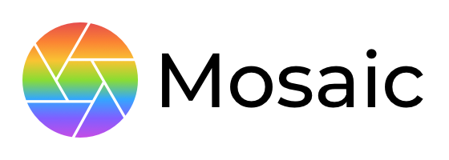
  <p>
    An open source computer vision library in Mojo
    
  
  
  
  </p>
</div>

<p align="center">
  <a href="#overview">Overview</a> •
  <a href="#installation">Installation</a> •
  <a href="#examples">Examples</a>
</p>

## Overview
#### Description
Mosaic is a cross-platform (macOS and linux) computer vision library for prototyping and production.

By transparently leveraging hardware acceleration and using the latest MLIR compiler technology, Mosaic is the first computer vision library built specifically for heterogenous compute: CPUs, GPUs, XPUs.

It unifies the computer vision workflow into one language that runs on any hardware.

#### Principles
1. Easy to use
2. Type-safe, memory-safe
3. Performant

#### Features
- Image representation
  - Image file encoding and decoding
  - Data type specification (at compile time)
  - Color space specification (at compile time)
- Image processing
  - Filtering
  - Geometric transforms
  - Fourier transforms
- Video capture (currently only macOS)
  - Stream connected cameras
- Video processing (currently only macOS)
  - Filter live video using custom processors
- Visualization (currently only macOS)
  - Native image and video rendering
- Hardware acceleration
  - Parallelization and SIMD on CPUs
  - GPU acceleration when available

## Installation
#### Prerequisites
- [Magic](https://docs.modular.com/magic/) (the Mojo environment and package manager)

#### Using the magic cli
```bash
magic add mosaic
```

#### After installation
The `mojoproject.toml` file should include the Modular community channel and the Mosaic dependency:
```toml
[project]
channels = ["https://repo.prefix.dev/modular-community"]

[dependencies]
mosaic = "*"
```

## Examples
#### Prerequisites
Clone the repo and build Mosaic:
```bash
git clone git@github.com:christianbator/mosaic.git
cd mosaic
magic run build
```

#### Running an example
Run an example file from the `examples/` directory like so:
```zsh
cd examples
magic run mojo load_image.mojo
```

#### Load image
- Loads an image file and displays it in the visualizer
- Source: [examples/load_image.mojo](examples/load_image.mojo)
<div align="center">
  
</div>

#### Save image
- Saves an image to a file
- Source: [examples/save_image.mojo](examples/save_image.mojo)

#### Scale image
- Scales an image to half size using bilinear interpolation
- Source: [examples/scale_image.mojo](examples/scale_image.mojo)
<div align="center">
  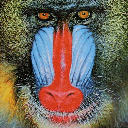
</div>

#### Resize image
- Resizes an image to double its width, stretching it in the process
- Source: [examples/resize_image.mojo](examples/resize_image.mojo)
<div align="center">
  
</div>

#### Slice image
- Slices the top half of an image
- Image slices are mutable views into the underlying image data
- Source: [examples/slice_image.mojo](examples/slice_image.mojo)
<div align="center">
  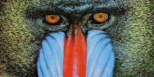
</div>

#### Rotate image
- Rotates an image by 90° clockwise
- Source: [examples/rotate_image.mojo](examples/rotate_image.mojo)
<div align="center">
  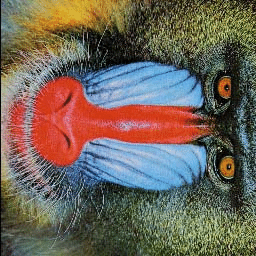
</div>

#### Flip image
- Flips an image vertically
- Source: [examples/flip_image.mojo](examples/flip_image.mojo)
<div align="center">
  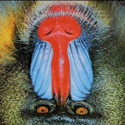
</div>

#### Pad image
- Pads an image with zeros
- Source: [examples/pad_image.mojo](examples/pad_image.mojo)
<div align="center">
  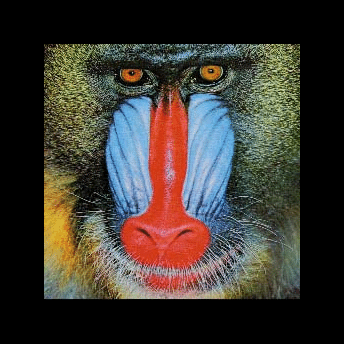
</div>

#### Convert type
- Starting with a `uint8` image, explicitly converts it to `float64`
- Source: [examples/convert_type.mojo](examples/convert_type.mojo)

#### Convert color space
- Converts an RGB image to greyscale
- Source: [examples/convert_color_space.mojo](examples/convert_color_space.mojo)
<div align="center">
  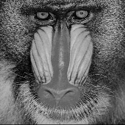
</div>

#### Convert color space as type
- Converts a `float64` RGB image to `uint8` greyscale in one method
- Source: [examples/convert_astype.mojo](examples/convert_astype.mojo)

#### Blur image
- Blurs an image using the built-in Gaussian kernel and reflected border handling
- Source: [examples/blur_image.mojo](examples/blur_image.mojo)
<div align="center">
  
</div>

#### Detect edges
- Detects edges in an image by smoothing and applying a custom Laplacian kernel
- Source: [examples/detect_edges.mojo](examples/detect_edges.mojo)
<div align="center">
  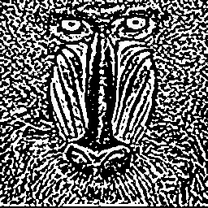
</div>

#### Unsharp mask
- Applies unsharp masking and image stacking to visualize the results
- Source: [examples/unsharp_mask.mojo](examples/unsharp_mask.mojo)
<div align="center">
  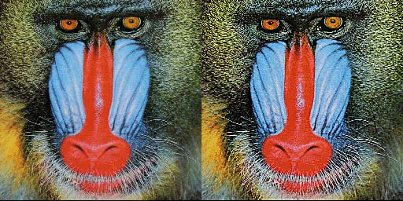
</div>

#### Picture in picture
- Captures a sub-rect of an image and copies it to the top left corner
- Source: [examples/picture_in_picture.mojo](examples/picture_in_picture.mojo)
<div align="center">
  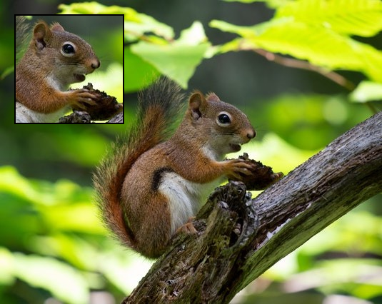
</div>

#### Extract channel
- Extracts the green channel of an RGB image
- Source: [examples/extract_channel.mojo](examples/extract_channel.mojo)
<div align="center">
  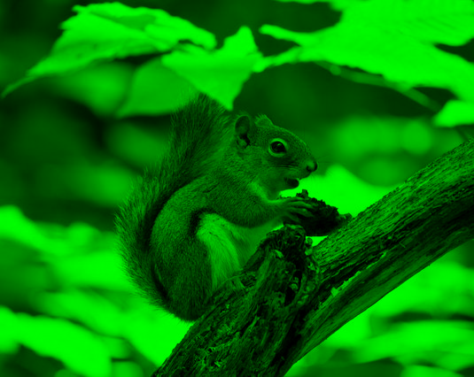
</div>

#### Fourier transform
- Calculates the spectrum of an image using the Fourier transform
- Source: [examples/fourier_transform.mojo](examples/fourier_transform.mojo)
<div align="center">
  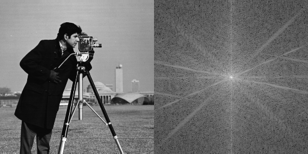
</div>

#### Inverse Fourier transform
- Recreates an image from a previously calculated spectrum
- Source: [examples/inverse_fourier_transform.mojo](examples/inverse_fourier_transform.mojo)
<div align="center">
  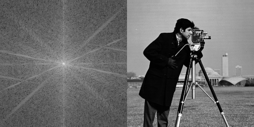
</div>

#### High-pass filter
- Applies a high-pass filter by discarding low frequencies in the spectrum
- Source: [examples/high_pass_filter.mojo](examples/high_pass_filter.mojo)
<div align="center">
  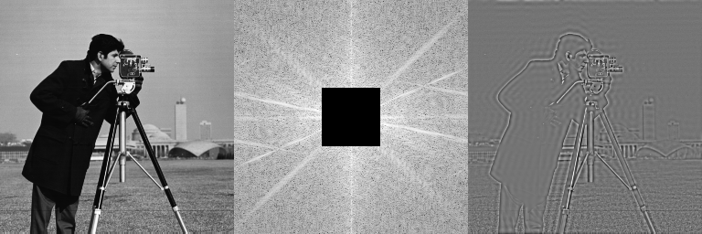
</div>
