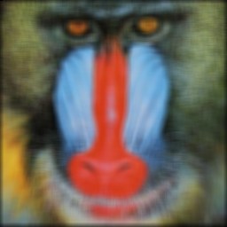

<div align="center">
  
  <p>
    An open source computer vision library in Mojo
    
  
  
  
  </p>
</div>

<p align="center">
  <a href="#overview">Overview</a> •
  <a href="#installation">Installation</a> •
  <a href="#examples">Examples</a>
</p>

## Overview
#### Description
Mosaic is a cross-platform (currently only macOS) computer vision library for prototyping and production.

By transparently leveraging hardware acceleration and using the latest MLIR compiler technology, Mosaic is the first computer vision library built specifically for heterogenous compute: CPUs, GPUs, XPUs.

It unifies the computer vision workflow into one language that runs on any hardware.

#### Principles
1. Easy to use
2. Type-safe, memory-safe
3. Performant

#### Features
- Image representation
  - Image file encoding and decoding
  - Data type specification (at compile time)
  - Color space specification (at compile time)
- Image processing
  - Filtering
  - Geometric transforms
  - Fourier transforms
- Video capture
  - Coming soon...
- Video processing
  - Coming soon...
- Visualization
  - Native image and video rendering
- Hardware acceleration
  - Parallelization and SIMD on CPUs
  - GPU acceleration when available

## Installation
#### Prerequisites
- [Magic](https://docs.modular.com/magic/) (the Mojo environment and package manager)

#### Using the magic cli
```bash
magic add mosaic
```

#### After installation
The `mojoproject.toml` file should include the Modular community channel and the Mosaic dependency:
```toml
[project]
channels = ["https://repo.prefix.dev/modular-community"]

[dependencies]
mosaic = "*"
```

## Examples
#### Prerequisites
Clone the repo and build Mosaic:
```bash
git clone git@github.com:christianbator/mosaic.git
cd mosaic
magic run build
```

#### Running an example
Run an example file from the `examples/` directory like so:
```zsh
cd examples
magic run mojo show_image.mojo
```

#### Show image
- Reads an image file into a UInt8 RGB representation and displays it in the visualizer
- Source: [examples/show_image.mojo](examples/show_image.mojo)
<div align="center">
  
</div>

#### Blur image
- Reads an image file, converts the data type, and applies a box filter to blur the image
- Source: [examples/blur_image.mojo](examples/blur_image.mojo)
<div align="center">
  
</div>
